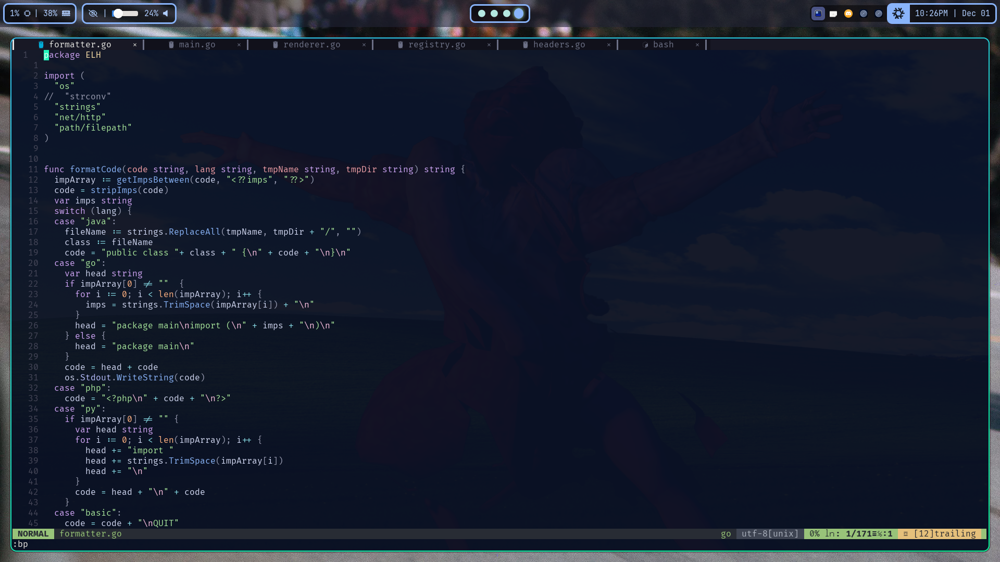
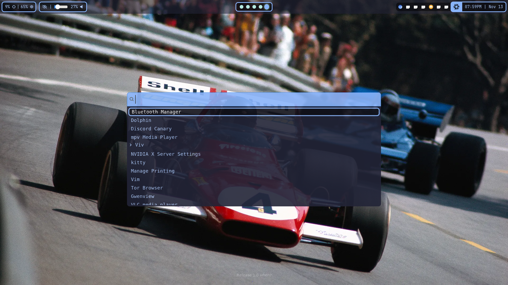

# some dotfiles

Not sure why you'd care, but these are my dotfiles

These are my current dotfiles for NixOS..... Oh, and my Nix Home-Manager for Debian. That's about it.

My Debian and NixOS installs are kept as closely alike as possible. However, some changes have to be made, since Debian can't just be configured like NixOS is. The NixOS configuration can be found [here](nixos), and the Debian configuration [here](debian).

---

## Screenshots

Desktop:

NeoVim in Ghostty:

Wofi

## Scripts

>[!NOTE]
>Any scripts marked as a binary are highly recommended that you install yourself, and not use the ones from my config (they were removed from the repo to prevent this problem)

- [start-hypr.sh](scripts/start-hypr.sh) (Bash)
  - A script that just runs my other scripts when Hyprland starts
  - Startup tasks and dependencies
    - `jq`
    - `hyprctl`
    - waybar
    - hyprpaper
    - mako
    - `xrandr`
    - [battery_notifier](https://github.com/Supraboy981322/misc-scripts/tree/master/battery_notifier)
- [screenshot.sh](scripts/screenshot.sh) (Bash)
  - A script that I have my screenshot keybind mapped to.
  - Dependencies
    - hyprshot
    - busybox
- [battery_notifier](https://github.com/Supraboy981322/misc-scripts/tree/master/battery_notifier) (Go binary)
  - A daemon that watches the battery and AC power state to send a notification when low or unplugged/plugged-in
  - Dependencies
    - `notify-send`
    - busybox
- [toggleWaybar.sh](scripts/toggleWaybar.sh) (Bash)
  - Mapped to a keybind so I can show/hide waybar
- [minimizeWindow.sh](scripts/minimizeWindow.sh) (Bash)
  - Mapped to a keybind so I can move a window to a different workspace without switching to it
  - Dependencies
    - `xdotool`
