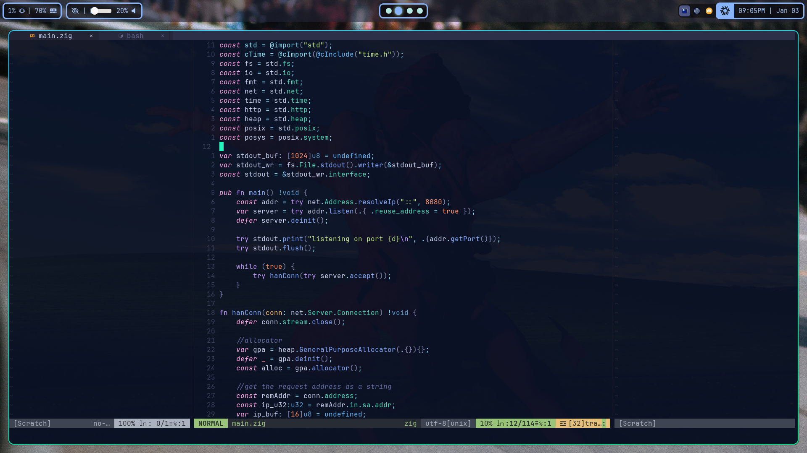

# some dotfiles

Not sure why you'd care, but these are my dotfiles

These are my current dotfiles for NixOS..... that's about it.

---

>[!WARNING]
>Some of the scripts in my setup are binaries, which may not run on all systems as I have them, so if you do use my setup, I recommend that you manually install the binaries (they're mostly written in Go, so you can just use `go install`). [see here for a list of the scripts used in this setup and their repo](#scripts)

---

## Details
- NixOS (obviously)
- Hyprland
- Zen Browser (not part of config, only `.desktop` file for now)
- Firefox (backup browser)
- Chromium (my school requires it)
- Tor Browser (for finding Linux ISOs)
- Tailscale 
- Nvidia open drivers (Nvidia sucks, I don't have money to buy a new GPU) 
- NeoVim (the superior code editor)
- Waybar
- Distrobox
- Ghostty (trying it out, I also have Konsole configured to my preferences)
- Dolphin (another preference)
- Kate (too lazy to find a better GUI code editor, NeoVim is too good)
- Hyprshot

---

## Screenshots

Desktop:

NeoVim in Ghostty:

Wofi

## Scripts

>[!NOTE]
>Any scripts marked as a binary are highly recommended that you install yourself, and not use the ones from my config

- [start-hypr.sh](scripts/start-hypr.sh) (Bash)
  - A script that just runs my other scripts when Hyprland starts
  - Startup tasks and dependencies
    - `jq`
    - `hyprctl`
    - waybar
    - hyprpaper
    - mako
    - `xrandr`
    - [battery_notifier](https://github.com/Supraboy981322/misc-scripts/tree/master/battery_notifier)
- [screenshot.sh](scripts/screenshot.sh) (Bash)
  - A script that I have my screenshot keybind mapped to.
  - Dependencies
    - hyprshot
    - busybox
- [battery_notifier](https://github.com/Supraboy981322/misc-scripts/tree/master/battery_notifier) (Go binary)
  - A daemon that watches the battery and AC power state to send a notification when low or unplugged/plugged-in
  - Dependencies
    - `notify-send`
    - busybox
- [toggleWaybar.sh](scripts/toggleWaybar.sh) (Bash)
  - Mapped to a keybind so I can show/hide waybar
- [minimizeWindow.sh](scripts/minimizeWindow.sh) (Bash)
  - Mapped to a keybind so I can move a window to a different workspace without switching to it
  - Dependencies
    - `xdotool`
